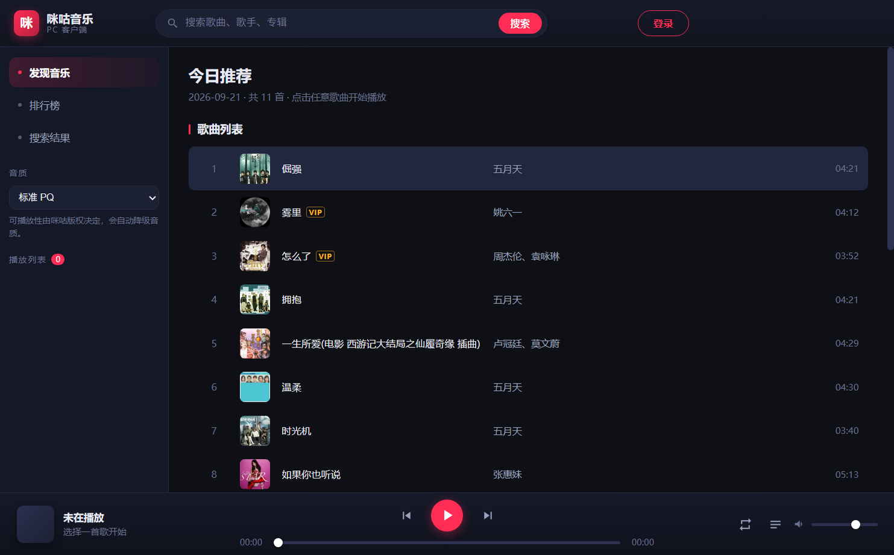
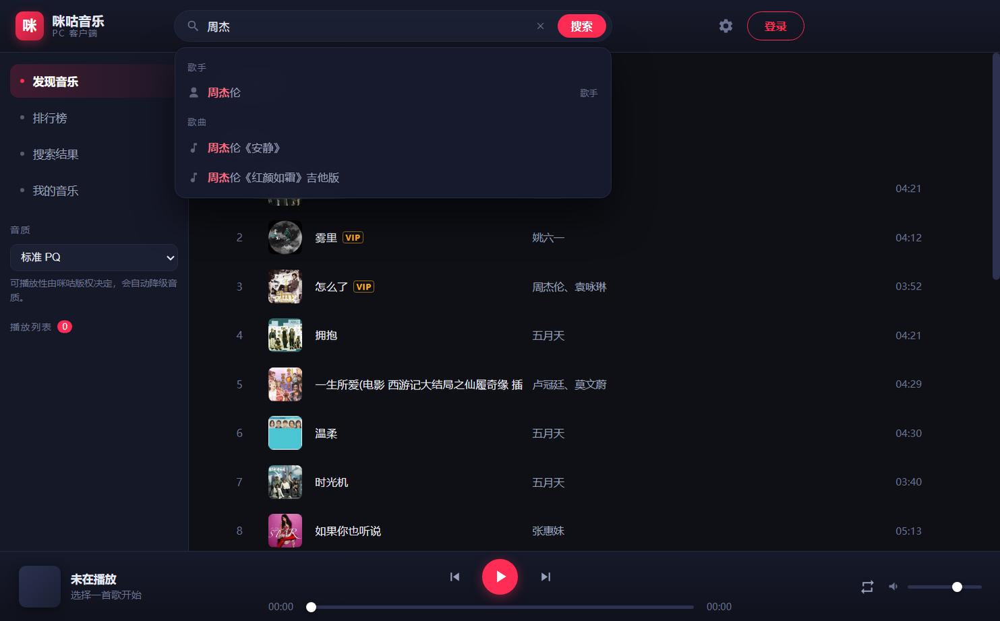
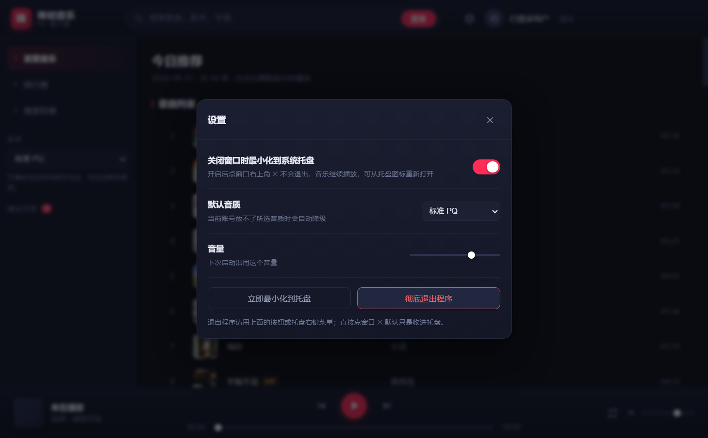

# 咪咕音乐 PC 客户端

一个基于 **Electron** 的咪咕音乐（music.migu.cn）桌面客户端，支持**登录**、**搜索**、**排行榜**、**在线播放**、**歌词同步**。

界面为自绘的深色播放器 UI，不依赖网页版，直接调用咪咕公开的音源接口。



| 搜索预测 | 全屏歌词 |
| --- | --- |
|  |  |

| 桌面歌词悬浮窗 | 设置 |
| --- | --- |
|  |  |

> 发布到 GitHub 时用的仓库简介 / 详细描述文案见 [`docs/DESCRIPTION.md`](docs/DESCRIPTION.md)。

---

## 功能

| 模块 | 说明 |
| --- | --- |
| 登录 | 内置咪咕官方登录窗口（`passport.migu.cn`），扫码 / 短信 / 密码登录均可；登录态持久化保存，重启免登录 |
| 搜索 | 支持歌曲 / 歌手 / 专辑关键词搜索，实时展示封面与 VIP 标记 |
| 搜索预测 | 搜索框下实时给出联想（歌手 / 歌曲，命中词高亮）；空输入聚焦时显示热门搜索 |
| 一键清除 | 搜索框内有内容时右侧浮现 ✕，点一下清空并回到热门搜索，焦点保留在输入框 |
| 排行榜 | 全网热歌榜、抖音热歌榜、免费热歌榜等 9 个榜单，可查看完整曲目 |
| 今日推荐 | 每日 50 首个性化推荐 |
| 播放 | 播放 / 暂停 / 上一首 / 下一首、进度拖动、音量调节、列表循环 / 单曲循环 / 随机播放 |
| 会员歌曲 | 登录会员账号后可播放 VIP 曲目（复用网页版官方 SDK 解密播放地址） |
| 音质 | 流畅 LQ / 标准 PQ / 高清 HQ / 无损 SQ，可播放性不足时自动降级 |
| 歌词 | **全屏歌词页**（左侧大封面 + 右侧大字滚动歌词，当前行高亮）；桌面歌词悬浮窗像字幕一样浮在桌面最上层 |
| 歌词入口 | 两个歌词开关都在**左下角歌曲封面**上，平时隐藏，鼠标靠近封面才浮现 |
| 歌词跳转 | 在歌词页**按住拖动**即可快进/回退到对应位置（松手生效）；**单击某句**也能直接跳过去 |
| 歌词浏览 | 拖动/滚轮自己翻歌词时自动暂停跟随（不被拽回当前句），点「回到当前」恢复 |
| 我的歌单 | 侧栏「我的音乐」页：账号概览 + 歌单卡片，**点卡片可查看歌单里的歌曲并直接播放**；歌曲行 ➕ 单曲加入，卡片 ➕ 整份播放列表批量加入 |
| 列表分页 | 歌单 / 搜索 / 榜单统一**每页 20 首**，末页自动收敛；上一页/下一页 + 页码跳转 |
| 歌单播放 | 点歌后自动把**整个歌单**（不只当前页）放进播放列表，随机播放可覆盖全部；另有「播放全部」 |
| 队列 | 左侧实时播放列表，点击任意曲目切歌 |
| 系统托盘 | 关闭窗口自动收进托盘继续播放；托盘右键可播放/暂停、切歌、退出 |
| 单实例 | 同一时间只允许一个客户端在跑；重复启动会把已有窗口唤到前台，而不是再开一个 |
| 设置 | 关闭行为、默认音质、音量，均可持久化保存 |
| 运行日志 | 关键事件写入 `.userdata/logs/`，设置里可一键打开日志文件；音频直链参数已脱敏 |
| 日志清理 | 可设「保留最近 7 天 / 30 天」，启动时按策略自动清理，也能点「立即清理」马上执行 |
| 快捷键 | `空格` 播放 / 暂停、`Esc` 关闭设置面板 |

---

## 怎么打开客户端

### 方式一：双击启动脚本

双击项目根目录的 `启动咪咕音乐.cmd`，脚本会自动检查依赖并启动。

### 方式二：命令行

```bash
npm start
```

### 修改代码后重新打包

```bash
npm run build:portable   # 重新生成 dist\咪咕音乐\
```

> 打包时会顺手做两处精简，都是可再生、且**不影响登录态**的内容：
>
> | 精简项 | 省下 |
> |---|---|
> | Electron 自带的 54 个语言包（只留简中 + 英文兜底） | 约 45 MB |
> | `.userdata` 里的 Chromium 缓存（`Cache` / `Code Cache` / `GPUCache` …） | 约 26 MB |
>
> 登录相关的东西一样没动：Cookie 在 `Network/`、登录令牌在 `Local Storage/`、
> 解密 Cookie 用的密钥在 `Local State`。
>
> ⚠️ 打包前先**退出正在运行的客户端**：它会独占 `dist` 里的文件，
> 从 `.userdata` 到 `咪咕音乐.exe` 都移不动，打包会半路失败。

> 若 `npm install` 之后 `node_modules/electron/dist` 为空（公司网络 / 沙箱拦截了 postinstall），
> 可手动下载对应版本二进制并解压到该目录：
>
> ```powershell
> node fetch-electron.mjs
> Expand-Archive .electron-cache\electron-v44.4.3-win32-x64.zip -DestinationPath node_modules\electron\dist -Force
> Set-Content node_modules\electron\path.txt -Value "electron.exe" -NoNewline
> ```

### 自检

```bash
npm run test:api     # 校验 API 层（搜索 / 榜单 / 直链 / 歌词）
npm run selftest     # 端到端校验（界面渲染 + 点击播放真实出声，附截图）
npm run test:vip     # 校验会员曲目地址解析（需已登录）
npm run verify:vip   # 在界面里实际播放一首会员歌曲（需已登录）
npm run check:login  # 校验登录窗口与登录表单是否正常
npm run smoke        # 以真实入口启动一次，截图后自动退出
npm run tray-test    # 校验托盘图标、关闭拦截、唤回窗口、退出路径
npm run test:lyric   # 校验歌词面板与桌面歌词悬浮窗
npm run test:single  # 校验单实例检测（启动两个实例，第二个应被拒绝）
npm run test:log     # 校验日志写入、URL 脱敏与「打开日志文件」按钮
npm run test:log-clean # 校验按 7 天 / 30 天保留期清理旧日志
npm run test:suggest # 校验搜索预测（热搜 / 联想 / 点选 / 键盘选择）
npm run check:cookies # 只读诊断：查看本地登录票据是否还在
npm run icons        # 重新生成托盘/应用图标
```

> 需要登录态的测试会先把 `dist` 里的登录数据**复制一份**到 `.userdata-xxx/` 再跑，
> 不碰你正在用的数据，也不和运行中的客户端抢文件。复制只取登录态与设置
> （Cookie、`localStorage` 里的登录令牌、`login/auth.json`），跳过 `Cache` / `Code Cache`
> 这类纯缓存 —— 它们对测试没用（约 26MB），客户端开着时还会被独占锁定、复制直接报 EACCES。

实测结果（本机 2026-09）：

```
[1] 搜索接口        PASS  搜索到 20 首
[2] 排行榜列表      PASS  9 个榜单
[3] 榜单歌曲        PASS  《全网热歌榜》共 49 首
[4] 今日推荐        PASS  11 首
[5] 播放直链解析    PASS  多首取到直链
[6] 歌词            PASS  1427 字节
[7] 界面渲染与播放  PASS  首页 11 行 + 9 卡片；搜索 19 行；《茶汤》实际播放 4.4s
登录窗口验证        PASS  passport 登录表单就绪（短信 / 密码 / SIM 登录）
会员曲目验证        PASS  《晴天》- 周杰伦 实际播放 6.4s / 270s
                          can-listen 确认 2/2 首 VIP 曲目「可播放」
托盘行为验证        PASS  托盘创建 / 设置落盘 / 关闭收进托盘 / 唤回窗口 / 退出路径
歌词功能验证        PASS  今日推荐曲目渲染 54 行歌词并逐行高亮
                          全屏歌词页铺满右侧主内容区（962x592）
                          拖动歌词快进：拖动中目标句高亮 + 气泡提示「松手跳到 00:16」
                          拖动期间视图纹丝不动（scrollTop 保持 0）
                          手动翻阅歌词不被拉回，点「回到当前」恢复跟随
                          单击第 15 句跳到 31.4s；双击不再触发锁定；点按钮锁定/解锁正常
单实例验证          PASS  第二个实例被拒绝并在 1s 内退出；已有实例收到 second-instance 通知
                          退出后锁文件已清理、可正常再启动；陈旧锁能自愈
日志功能验证        PASS  多级别日志写入 / 音频 URL 已脱敏
                          设置面板「打开日志文件」按钮就位，调用 shell.openPath 成功并记入日志
日志清理验证        PASS  7 天保留期删掉 10/40 天前两个；30 天保留期只删 40 天前那个
                          正在写入的日志永不误删；保留期设 0 时不删任何文件
搜索预测验证        PASS  空输入显示热门搜索 5 条；输入「周杰」返回歌手+歌曲联想并高亮
                          点选后填入搜索框并搜出 20 条；↓ 选中 + Enter 采用选中项
```

截图见 `docs/screenshots/`。

> 在受限沙箱 / 无 GUI 环境下 Electron 可能无法创建命名管道，需要以普通用户身份在桌面上运行；
> 此时可先用 `npm run test:api` 验证接口层（纯 Node，无需 GUI）。

---

## 目录结构

```
migumusic/
├── main.js              # Electron 主进程：窗口、登录、系统托盘、设置
├── preload.js           # contextBridge 安全桥（渲染层只能调用白名单方法）
├── assets/
│   ├── icon.png         # 应用图标（256）
│   └── tray.png         # 托盘图标（32）
├── src/
│   ├── migu-api.js      # 咪咕内容接口（搜索/榜单/歌单/推荐/歌词）
│   ├── resolver.js      # 播放地址解析器（隐藏窗口复用网页版 SDK 解密，支持会员曲目）
│   ├── lyric-window.js  # 桌面歌词悬浮窗
│   ├── settings.js      # 设置持久化
│   └── ipc.js           # IPC 注册（主进程与自检脚本共用）
├── renderer/
│   ├── index.html       # 界面结构
│   ├── style.css        # 深色主题样式
│   ├── app.js           # 视图渲染 + 播放器逻辑
│   ├── lyric.html       # 桌面歌词窗口
│   └── lyric.js         # 桌面歌词渲染
├── selftest.js          # Electron 端到端自检
├── test-api.js          # API 层自检（纯 Node）
├── test-vip.js          # 会员曲目解析自检
├── verify-vip.js        # 会员曲目界面播放验证
├── test-lyric.js        # 歌词面板 + 桌面歌词验证
├── login-check.js       # 登录窗口自检
├── make-icons.mjs       # 图标生成（手写 PNG 编码，无第三方依赖）
└── fetch-electron.mjs   # Electron 二进制手动下载脚本
```

---

## 工作原理

客户端直接调用咪咕音乐 H5 / App 端的公开接口，由主进程统一发起（走 Electron `net`，自动携带登录 Cookie）：

| 用途 | 接口 |
| --- | --- |
| 搜索 | `pd.musicapp.migu.cn/MIGUM2.0/v1.0/content/search_all.do` |
| 排行榜列表 | `app.c.nf.migu.cn/pc/bmw/rank/rank-index/v1.0` |
| 榜单曲目 | `app.c.nf.migu.cn/pc/bmw/rank/rank-info/v1.0` |
| 歌单详情 | `app.c.nf.migu.cn/column/column-info/h5/v2.0` |
| 今日推荐 | `app.c.nf.migu.cn/pc/v1.0/template/todayRecommendList/release` |
| 歌曲详情 | `app.c.nf.migu.cn/MIGUM3.0/resource/song/by-songids/v2.0` |
| 可播放性 | `app.c.nf.migu.cn/strategy/pc/can-listen/v1.0` |
| 播放直链 | `app.c.nf.migu.cn/strategy/pc/listen/v2.0`（**响应加密**，见下） |

### 播放地址是怎么拿到的（关键设计）

咪咕的播放地址有两条路，本客户端两条都用了：

1. **App 端老接口** `listenSong.do`：免费曲目会 302 跳到真实音频，但**不认网页版登录态**，
   会员歌曲一律拿不到地址。作为兜底保留。

2. **网页版接口** `strategy/pc/listen/v2.0`：这才是会员账号的正路，但它有两个难点——
   调用处写的是 `{encrypt: !0}`，**响应是加密的**，直接 HTTP 请求只能拿到一堆二进制。

   本客户端的做法是：用一个**隐藏窗口加载咪咕网页版**，再复用页面里自己的
   `@migusdk` 模块发起请求并解密（`src/resolver.js`）：

   ```js
   // 隐藏窗口内执行
   const m = await import('/v5/static/js/@migusdk-xxxx.js');
   const res = await m.h.get('/strategy/pc/listen/v2.0', params, { encrypt: true });
   // res.data.url 即为解密后的播放直链
   ```

   这样做的好处：
   - **不用逆向加密算法**，官方换算法也不受影响；
   - 隐藏窗口与主窗口共享持久化 Session，**自动带上登录 Cookie，会员权益正常生效**；
   - SDK 的 chunk 名带 hash，代码通过 `performance.getEntriesByType('resource')`
     动态发现，官方改版换 hash 也不会失效。

   > 另外 `can-listen` 接口会在列表加载后批量查询，把当前账号**放不了的曲子标成「受限」**、
   > 只能试听的标成「试听」，避免点了才发现放不了。

**音质降级**：按 `SQ → HQ → PQ → LQ` 依次尝试，取到即用。

### 运行日志

每次启动都会在 `.userdata/logs/` 下新建一个 `migu-<日期-时间>.log`，记录：

- 启动 / 退出、命令行参数
- 单实例拦截、重复启动唤回
- 登录成功 / 恢复 / 登出、票据失效
- **播放地址解析结果**（歌曲、音质、走的是网页版 SDK 还是 App 接口、耗时、失败原因）
- 解析器（隐藏窗口）就绪耗时或失败原因
- 设置变更、窗口收进托盘

只有最近 12 个日志文件会保留，老的自动清理。

**设置 →「运行日志」→ 打开日志文件** 即可用系统默认程序打开；旁边「文件夹」按钮能在资源管理器里定位它。

**清理旧日志**：设置里可以选保留最近 **7 天** / **30 天**（或「不自动清理」），
每次启动会按这个策略自动清一次；也可以点**「立即清理」**马上执行。
这一行还会显示当前日志占用了多少个文件、多少空间。

> 清理时**正在写入的那个日志永远不会被删**；保留期设成 0 则完全不清理。

> 日志里的音频直链会**去掉查询参数**再记录，`Key`、`msisdn` 这类凭据不会落盘。

### 缓存与「清除缓存」

浏览页面、加载封面和歌单时会留下 Chromium 的运行时缓存（`.userdata/` 下的
`Cache`、`Code Cache`、`GPUCache`、`DawnGraphiteCache`），用得久了能攒到几十 MB。

**设置 →「清除缓存」** 会显示当前占用，点按钮并确认即可清理。

> **不会掉登录。** 清理名单是写死的白名单，只包含上面那几个纯缓存目录；
> Cookie 在 `Network/`、登录令牌在 `Local Storage/`、解密 Cookie 用的密钥在
> `Local State`、应用自己的票据在 `login/` —— 全都在保护范围内，一个都不会碰。

清理分两步，因为运行中的 Chromium 会独占锁住这些文件：

1. 先调 Electron 的 `clearCache()` / `clearCodeCaches()` —— 这是唯一能安全清掉
   「正在使用中」缓存的方式，而且只作用于 HTTP 缓存与 V8 代码缓存；
2. 再把官方接口覆盖不到的目录（GPU / Dawn 渲染缓存）删掉，个别文件被占用就跳过。

代价是清理后重新打开那些页面会稍慢一点（要重新下载）。如果有文件正被占用，
界面会如实提示「另有 X 使用中，重启后释放」，而不是假装清干净了。

### 单实例（禁止多开）

重复双击图标不会再开一个窗口，而是把已有窗口唤到前台，并在界面里提示「已经在运行了」。

用了两层检测：

1. **Electron 原生单实例锁** —— 拦住同一份客户端被点多次
2. **`%TEMP%\migu-music-desktop.lock` 里的 pid 锁** —— 拦住「把客户端拷成两份、分别启动」
   这种情况（副本各自有独立 userData，原生锁是拦不住的）

退出时会清理锁文件；**即使进程被强杀留下陈旧锁，下次启动检测到里面的 pid 已不存在会自动接管**，
不会把客户端锁死。验证见 `npm run test:single`。

### 搜索预测

在顶部搜索框里打字，下方会实时浮出建议：

- **空输入聚焦** → 显示**热门搜索**（咪咕热搜榜）
- **输入文字** → 显示**歌手**与**歌曲**两组联想，命中的关键词用品牌色高亮
- **↑ / ↓** 在建议间移动，**Enter** 直接采用选中项搜索，**Esc** 收起
- 鼠标点任意一条直接搜索；点面板外面自动收起
- 搜索框内有内容时右侧会浮现 **✕**，点一下清空、回到热门搜索，**焦点留在输入框**方便继续输入

联想接口 `app.u.nf.migu.cn/.../tone_search_suggest`（输入 220ms 防抖），
热门搜索 `app.c.nf.migu.cn/pc/bmw/hot-search/hot-search/v1.0`。
请求带序号，慢返回的旧结果不会覆盖新结果。

### 我的歌单 / 加入歌单

侧栏点进**「我的音乐」**，会实时从你的咪咕账号读出歌单：

```
┌──────────────────────────────────────────────────────┐
│ (头像) 你的昵称                  201      1      0    │
│        已登录                  我喜欢的 自建歌单 收藏歌单│
└──────────────────────────────────────────────────────┘

我喜欢的
  ♥ 我喜欢的     201 首

我的歌单
  ▣ 我喜欢        61 首
```

两种加入方式：

| 入口 | 作用 |
| --- | --- |
| **歌曲行**右侧的 ➕（鼠标移上去才出现） | 把**单首歌**加入指定歌单 |
| **歌单封面**上的 ➕ | 把**当前整个播放列表**批量加入该歌单 |

**点歌单卡片**可以查看歌单里的歌曲列表，并能直接播放。列表**按页取**，不再一次性全拉：

```
← 返回我的音乐
我喜欢的
共 201 首 · 每页 20 首 · 单击/双击播放，鼠标移到行上可加入别的歌单

  1  我恨明月不照我      墨染        单曲发行       04:04
  2  他乡的月亮          熙月月      他乡的月亮      03:40
 ...
 20  ...

         [上一页]  1  …  9  10  [11]  下一页     共 201 首 · 第 11/11 页
```

翻到第 11 页就只有 1 首（序号 201），「下一页」自动置灰。第 2 页的行号接着第 1 页从 21 开始。

### 分页只影响「看」，不影响「听」

歌单页每页只显示 20 首，但**播放队列是整个歌单**：

- **点某一首歌** → 先按当前页立即起播（响应快），随后后台把整个歌单拉下来补进播放列表
- **点「播放全部（201 首）」** → 直接载入整个歌单从头播

这样**随机播放能覆盖歌单里的全部歌曲**，而不是只在当前页的 20 首里打转。
补全成功后会提示「已把整个歌单（201 首）放进播放列表」。

> 实测：连点 12 次「下一首」，有 11 次跳到了第 20 首之后（下标 `98, 30, 5, 144, 153, 197, …`）。

> 顺带一提：**咪咕搜索接口会忽略 `pageSize`，固定每页 20 条**（正好与客户端一致），
> 页数按实际返回条数算——`共 401 首` 是 21 页而不是 9 页。

加入后会照实反馈：`已加入「我喜欢」：成功 12 首，3 首已存在，1 首不支持`。

**这些接口必须借用网页版自己的 http 客户端来发**：咪咕的用户态接口依赖客户端自动注入的
`uid` / `token` 等 header，直接用自己的网络请求会被判定为「请先登录」。
所以这里复用了播放地址解析器那个隐藏窗口（见 `resolver.webCall`）。

| 操作 | 接口 |
| --- | --- |
| 读取我的歌单 | `GET /pc/user/home-page/v2.0` |
| **歌单里的歌曲** | `GET /MIGUM3.0/resource/playlist/song/v2.0?playlistId=x&pageNo=1&pageSize=50` |
| 歌单信息 | `GET /resource/playlist/v2.0?playlistId=x` |
| 加入歌单 | `POST /pc/user/api/add-music-list-song/v1.0`，body `{id, contentIds}` |
| 加入「我喜欢的」 | 同上，省略 `id` |
| 查询歌曲在哪些歌单 | `GET /pc/v1.0/content/inMusicLists.do?type=1&contentId=a\|b` |

> 歌单歌曲接口单页上限 50 首，客户端统一按 **20 首/页**取，翻页时才请求下一页。
> 「我喜欢的」的 id 不在歌单列表里，是从用户主页的 `actionUrl` 里抠出来的。

### 系统托盘与关闭行为

默认情况下，点窗口右上角的 **✕** 不会退出程序，而是**收进系统托盘**，音乐继续播放。

- **唤回窗口**：单击（或双击）托盘图标
- **托盘右键菜单**：显示主窗口 / 播放暂停 / 上一首 / 下一首 / 关闭时最小化到托盘 / 退出
- **彻底退出**：托盘右键 →「退出咪咕音乐」，或界面里 ⚙ 设置 →「彻底退出程序」
- **改回直接退出**：界面右上角 ⚙ → 关掉「关闭窗口时最小化到系统托盘」

设置项存在 `.userdata/settings.json`，音质与音量也一并持久化。

> 首次收进托盘时会弹一次气泡提示，之后不再打扰（`trayTipShown` 控制）。

### 歌词是怎么拿到的

咪咕的**列表类接口（榜单 / 今日推荐）根本不返回歌词地址**，
只有搜索接口自带 `lyricUrl`。所以歌词只能从**播放接口**顺带取回：

```js
// resolver 调用 listen/v2.0 后，响应里同时带着歌词地址
res.data.url     // 音频直链
res.data.lrcUrl  // 歌词地址（LRC）
```

客户端在拿到播放地址后，如果发现比歌曲自带的歌词地址更可靠，就换成它并重新加载歌词，
这样**任何来源的歌曲都能显示歌词**（实测今日推荐曲目从「0 行」变成 54 行）。

### 全屏歌词页

点**左下角歌曲封面**上的「歌词面板」按钮打开（鼠标靠近封面才浮现）。左侧是大封面与歌曲信息，
右侧是滚动歌词，当前行白色加粗带光晕。

**拖动歌词可以快进**：按住任意一句上下拖，拖到哪句顶部就会浮出「松手跳到 00:16 · 逆流而上」
的提示、那一句同时高亮预览，松手即跳过去。**单击某句**也能直接跳到那句的位置。

**拖的时候视图不会自己跑**：一旦按住歌词，自动跟随立即暂停、平滑滚动被关掉，
滚动位置被钉死，所以可以安心对准想跳的那一句。

**自己翻歌词也不会被拽回来**：用滚轮或拖滚动条浏览时，自动跟随会自动暂停，
右下角浮出「⤓ 回到当前」按钮；点它（或拖动/单击跳转、切歌）才恢复跟随。

- `Esc` 或右上角 ✕ 关闭

### 桌面歌词（悬浮字幕）

点**左下角歌曲封面**上的「桌面歌词」按钮（鼠标靠近封面才会浮现），
会开一个无边框透明置顶窗口，像字幕一样浮在桌面上：

- **拖动**：按住歌词条任意位置拖动，位置自动记住
- **锁定**：鼠标移到歌词条上，点右侧「🔒 锁定」按钮 → 鼠标穿透，不再挡住其它窗口
- **控制条**：默认半透明常驻（不用去猜），鼠标移上去变清晰；含 `A−` `A+` 字号、锁定、关闭
- **解锁**：托盘右键 →「锁定桌面歌词（鼠标穿透）」取消勾选，或点界面上的桌面歌词按钮
- **托盘右键**里也有「桌面歌词」开关
- 锁定后控制条会自动隐藏，解锁后自动恢复

白色大字带黑色描边，所以在浅色/深色壁纸上都看得清。

> 顺带一提：Electron 的 `net.fetch` 在 `redirect:'manual'` 下拿不到 `Location`（opaque redirect），
> 因此 `listenSong.do` 的直链探测是用 `net.request` 的 `redirect` 事件实现的，
> 见 `src/migu-api.js: probeRedirect`。

**登录流程**：点击右上角「登录」→ 打开独立的咪咕官方登录窗口（与主窗口共享持久化 Session）→
自动点开登录框（短信 / 密码 / SIM 三种方式）→ 轮询检测登录后新增的 Cookie →
判定成功并抓取昵称、头像 → 通知主界面刷新。

登录态判定不使用宽松的关键词匹配，而是**记录登录瞬间新增的 Cookie 名**并写入
`.userdata/login/auth.json`（**登录信息单独放在 `login/` 目录里**），重启后仅当这些 Cookie
依然存在才算已登录，避免把 `migu-device-uuid`、`mg_uem_user_id_*` 等匿名 Cookie 误判成登录状态。

```
.userdata/
├── login/                  ← 登录信息都在这儿
│   ├── auth.json           登录态记录（登录时间、昵称、登录时的 Cookie 名单）
│   └── 说明.txt            说明哪些文件在这里、Cookie 为什么不在这里
├── logs/                   运行日志
├── settings.json           设置
├── Network/Cookies         浏览器 Cookie（Chromium 管，位置固定，动不了）
└── Cache / GPUCache / ...  各种缓存
```

> 老版本的 `auth.json` 散在 `.userdata` 根目录，启动时会**自动迁移**进 `login/`。
>
> 想彻底退出登录，用界面右上角的「退出」按钮（会同时清 Cookie 和 `auth.json`）；
> 手动清理的话只删 `login/` 不够，还得删 `Network/Cookies`。

**登录态不会被误清**：`auth.json` 丢失、或它记录的 Cookie 因为票据轮换而过期时，
只要本地还有 `pacmtoken` / `idmpauth` / `mg_auth_sid` 这类**明确的登录票据**，
启动时会自动认回登录态并重建 `auth.json`，不需要重新登录。

> 想确认当前登录票据还在不在，可以跑 `npm run check:cookies`（只读诊断）。

---

## 已知限制

- **会员曲目取决于账号权益**：已实测登录会员账号可正常播放周杰伦《晴天》《圣诞星》等 VIP 曲目。
  若账号没有对应权益，客户端会把曲子标为「受限」并给出提示，不会静默失败。
- **音质**：无损 / 高清需要相应会员等级，未达标时自动降级到可用的音质。
- **解析器需要联网加载咪咕网页版**：首次点歌会有一个隐藏窗口在后台加载，约 1～3 秒；
  加载完成后一直复用，后续点歌是即时的。
- 接口为非官方公开接口，咪咕若大改版可能失效；届时主要改 `src/resolver.js`（SDK 发现逻辑）
  与 `src/migu-api.js`（内容接口）。

---

## 免责声明

本项目仅供个人学习与技术研究使用，所有音乐内容版权归咪咕音乐及其版权方所有。
请勿用于任何商业用途或大规模抓取。

本项目与咪咕音乐官方无关，未获得其授权或认可。

---

## 开源协议

[MIT](LICENSE)

## 参与贡献

欢迎提 Issue / PR。改动前建议先跑一遍自检：

```bash
npm run test:api && npm run selftest
```

涉及登录 / 歌单 / 分页的改动，请一并跑对应的验证脚本（`test:playlist`、`test:pager` 等，
完整列表见上方「自检」一节）——这些脚本会真实调用接口并核对结果，比只跑单元测试可靠得多。

> 提交代码前请确认 `.userdata/` 与 `dist/` 没被加进暂存区（`.gitignore` 已挡住），
> 前者包含你自己的登录 Cookie。
